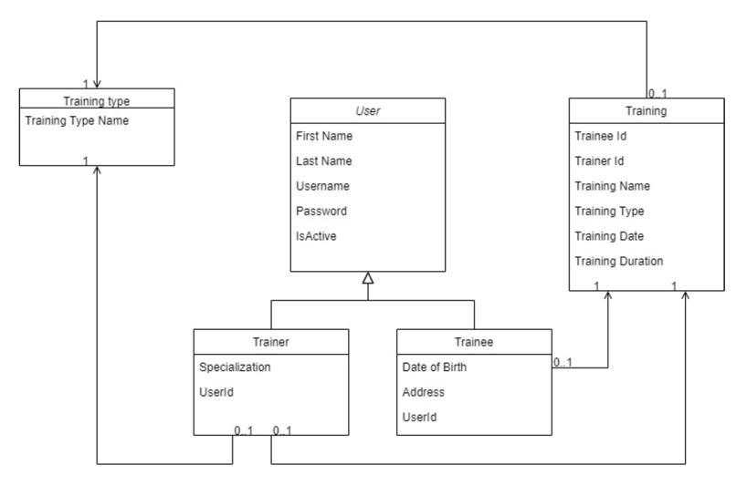

# Gym CRM Application

This is a Gym Customer Relationship Management (CRM) application. It is a console-based application that allows you to
manage trainees, trainers, and training sessions in a gym environment.

## Features

- Manage Trainees: Create, update, delete, and view trainee profiles.
- Manage Trainers: Create, update, and view trainer profiles.
- Manage Trainings: Create and view trainings.

## Execution

You can download the JAR file for this project from the "Releases" section on the GitHub repository page. Please ensure
to download the latest release for the most up-to-date version of the application. After downloading, you can run the
JAR file using the java -jar command in your terminal or command prompt.

```bash
java -jar gym-crm-0.0.1-SNAPSHOT.jar
```

> Note: You need to have Java installed on your system to run the application.

## Technologies

- Java 17
- Spring Framework 6.1.5
- Gradle 7.3.3
- Lombok 8.6
- Jackson 2.17.0
- SLF4J 2.0.13
- Log4j 2.21.1
- Jakarta Validation 3.1.0-M2

## Getting Started

### Prerequisites

- Java 17
- Gradle 7.3.3

### Running the Application

1. Clone the repository to your local machine.
2. Navigate to the project directory.
3. Run the application using Gradle:

```bash
gradle run
```

### Running the Tests

To run the tests, use the following command:

```bash
gradle test
```

## Execution

After building the project, you can run the application using the `java -jar` command. Here's how:

1. Open a terminal window.
2. Navigate to the target directory of the project where the jar file is located.
3. Run the following command:

```bash
java -jar gym-crm-0.0.1-SNAPSHOT.jar
```

> Note:
> Please ensure that the jar file name matches the one generated by your build tool.

## Structure

The application follows a standard layered architecture:

- `domain`: Contains the domain model classes.
- `dao`: Contains the Data Access Object (DAO) classes for interacting with the data storage.
- `service`: Contains the service classes that implement the business logic.
- `facade`: Contains the facade classes that provide a unified interface to the services.
- `ui`: Contains the user interface classes.
- `configuration`: Contains the configuration classes.
- `utils`: Contains utility classes.

---

#### Spring core task

Create a Spring-based module, which handles gym CRM system.
Based on follow objects description:



1. Implement three service classes Trainee Service, Trainer Service, Training Service
2. Trainee Service class should support possibility to create/update/delete/select Trainee
   profile.
3. Trainer Service class should support possibility to create/update/select Trainer profile.
4. Training Service class should support possibility to create/select Training profile.

Notes:

1. [x] Configure spring application context based on the Spring annotation or on Java based
   approach.
2. [x] Implement DAO objects for each of the domain model entities (Trainer, Trainee,
   Training). They should store in and retrieve data from a common in-memory storage -
   java map. Each entity should be stored under a separate namespace, so you could list
   particular entity types.
3. [x] Storage should be implemented as a separate spring bean. Implement the ability to
   initialize storage with some prepared data from the file during the application start (use
   spring bean post-processing features). Path to the concrete file should be set using
   property placeholder and external property file. In other words, Every storage
   (`java.util.Map`) should be implemented as a separate spring bean.
   (Partially implemented, only `Trainee` and `Trainer` storage is implemented)

4. DAO with storage bean should be inserted into services beans using auto wiring. Services
   beans should be injected into the facade using constructor-based injections. The rest of
   the injections should be done in a setter-based way.
5. Cover code with unit tests.
6. Code should contain proper logging.
7. For Trainee and Trainer create profile functionality implement username and password
   calculation by follow rules:
    - [x] Username going to be calculated from Trainer/Trainee first name and last name
      by concatenation by using dot as a separator (eg. John.Smith)
    - [x] In the case that already exists Trainer or Trainee with the same pair of first and
      last name as a suffix to the username should be added a serial number.
    - [x] Password should be generated as a random 10 chars length string.